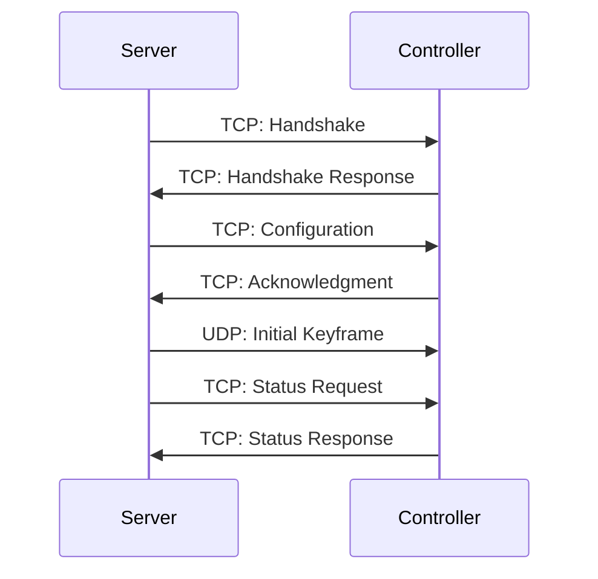
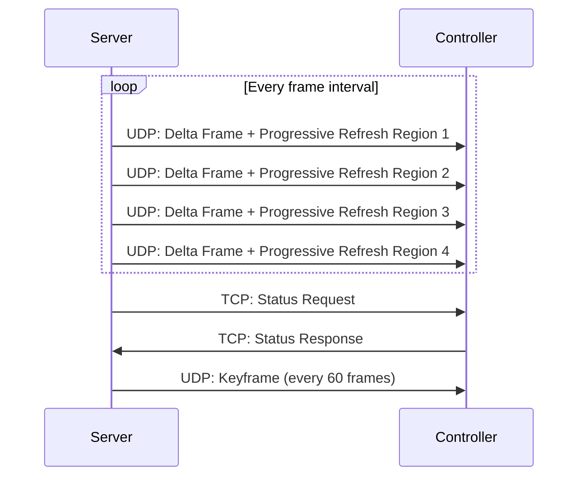
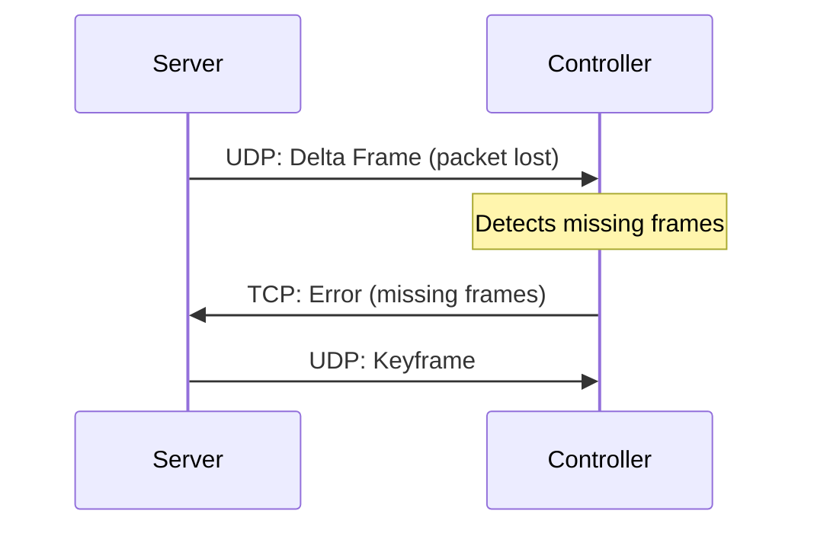

# PixelPulse Protocol (PPP) v0.9.0
## Draft Specification

A dual-channel, high-performance protocol for driving LED matrices with efficient bandwidth usage and reliable delivery.

---

## Background

I'm working on a large LED wall project that needs to show high-quality animations and even video, all with individual pixel-level control. Initially, I tried using an ESP32-C3 running WLED on a small 8×32 WS2812B panel. While it was great for quick demos and simple effects, it hit a ceiling when I tried to push video content or manage thousands of pixels at high frame rates. WLED's built-in API doesn't really handle that kind of data load, so I decided to develop a more specialized approach.

That's where PixelPulse Protocol (PPP) comes into the picture. PPP is a dual-channel protocol I'm creating to separate fast, low-latency pixel data (UDP) from the more reliable, bidirectional control channel (TCP). The idea is to keep the pixel stream lean and efficient while ensuring that important commands, status updates, and error handling aren't lost. This architecture not only helps manage large frame buffers but also keeps the display synchronized even if some data packets get dropped along the way.

To bring PPP to life, I'm designing a custom PCB that combines two main processors:
- **Teensy 4.1** – Handles the heavy lifting of driving the LED signals at precise timings. It has enough horsepower to deal with large frame buffers and high refresh rates, making it ideal for multi-panel LED walls.
- **ESP32** – Equipped with a Wi-Fi module, it serves as the networking interface and does some preprocessing on incoming data before passing it on to the Teensy.

I'm also using two SN74HCT245 level shifters to ensure the 3.3 V signals from the Teensy get bumped up to the 5 V the LEDs require. A dedicated 5 V power supply, along with a handful of passive components, keeps everything running smoothly—especially important when you're dealing with potentially thousands of LEDs.

On the software side, I'm writing custom firmware for both the Teensy and the ESP32. Meanwhile, a server application takes care of receiving and processing video or image data, then uses PPP to send pixel updates in real time. A web GUI acts as the control center for everything, letting me adjust brightness, animations, and other settings on the fly. Future blog posts will dig into each piece of the puzzle—how the PCB is laid out, how the firmware is structured, how the protocol handles high frame rates without dropping frames, and more.

In essence, PixelPulse Protocol and this custom hardware stack are all about solving the limitations I faced with existing solutions, providing a scalable, robust, and flexible system for high-resolution LED displays. By offloading video processing to the server and using PPP to deliver frames and control messages, I can manage large installations without sacrificing performance or reliability.

## 1. Protocol Overview

PixelPulse is a purpose-built protocol for LED display control that prioritizes efficiency, reliability, and responsiveness. It uses UDP for pixel data transmission and TCP for control commands, combining the benefits of both transport mechanisms.

### 1.1 Key Features

- **Dual-Channel Architecture**: Separate UDP (data) and TCP (control) channels
- **Delta Encoding**: Transmit only changed pixels to minimize bandwidth
- **Progressive Refresh**: Systematic refresh of display regions to prevent stuck pixels
- **Flexible Resolution**: Support for displays from small (8×8) to large (128×128+) LED matrices
- **Resilient Design**: Recovery mechanisms for packet loss and network fluctuations
- **Bidirectional Communication**: Status monitoring and control capabilities
- **Lightweight Implementation**: Optimized for microcontroller environments

### 1.2 Design Principles

- **Performance First**: Optimized for high frame rates on constrained networks
- **Graceful Degradation**: Maintains visual quality under suboptimal conditions
- **Simplicity**: Easy to implement on resource-constrained systems
- **Extensibility**: Structured for future enhancement without breaking compatibility

## 2. Protocol Architecture

### 2.1 Channel Structure


1. **UDP Data Channel**
   - High-throughput pixel data transmission
   - Delta encoding for bandwidth efficiency
   - Progressive refresh for reliability
   - Unidirectional (server to controller)

2. **TCP Control Channel**
   - Reliable bidirectional communication
   - Controller status and health monitoring
   - Configuration settings and commands
   - Error reporting and recovery coordination

## 3. UDP Data Channel Specification

### 3.1 Packet Structure


#### Header (20 bytes)
```
0-1:   Magic bytes        [0x50, 0x58]      "PX" identifier
2-3:   Protocol version   [0x00, 0x09]      v0.9.0
4-7:   Frame number       uint32            Monotonically increasing
8-11:  Timestamp          uint32            Milliseconds since epoch
12:    Flags              uint8             Frame type and format flags
13:    Fragment number    uint8             0-255 for fragmented frames
14:    Total fragments    uint8             Total count for this frame
15-16: Data length        uint16            Payload length in bytes
17-18: Display ID         uint16            For multi-display setups
19:    Header checksum    uint8             XOR of all header bytes
```

#### Flags Byte
```
Bit 0:    Frame type       0=delta, 1=keyframe
Bits 1-2: Data format      00=RGB, 01=RGBW, 10=HSV, 11=Compressed
Bits 3-4: Fragment type    00=complete, 01=first, 10=middle, 11=last
Bits 5-6: Refresh region   00=none, 01=region1, 10=region2, 11=region3
Bit 7:    Sync request     0=normal, 1=request acknowledgment
```

#### Payload Formats

**Keyframe (Complete Frame)**
```
[pixel data for entire display]
```

**Delta Frame with Progressive Refresh**
```
// Header section: Refresh region data
[refresh_region_index]     uint8    Starting index of refresh region
[refresh_region_size]      uint8    Number of pixels in refresh region
[refresh_pixel_data]       bytes    RGB data for pixels in refresh region

// Deltas section: Changed pixels
[changed_pixel_count]      uint16   Number of changed pixels
[changed_pixel_index]      uint16   Position of changed pixel
[changed_pixel_data]       bytes    RGB data for changed pixel
... repeated for each changed pixel
```

### 3.2 Delta Encoding Implementation

Delta encoding transmits only pixels that changed since the previous frame:

1. **Server-side process**:
   - Compare current frame to previous frame
   - Record indices of pixels that changed
   - If changes exceed threshold (e.g., >60%), send as keyframe instead
   - Otherwise, send delta frame with list of changed pixels

2. **Controller-side process**:
   - Maintain complete frame buffer
   - For keyframes: Replace entire buffer
   - For delta frames: Update only specified pixel positions
   - Always apply progressive refresh region updates

### 3.3 Progressive Refresh Mechanism

To prevent "stuck pixels" from lost packets, each delta frame includes a complete refresh of a portion of the display:

1. **Display Segmentation**:
   - Divide display into N regions (typically 8-10)
   - Cycle through regions sequentially

2. **Refresh Procedure**:
   - Each frame includes one complete refresh region
   - After N frames, entire display has been refreshed
   - Any stuck pixels will be corrected within N frames

3. **Region Sizing**:
   - Each region = Total pixels ÷ Number of regions
   - Example: 1024 pixel display with 8 regions = 128 pixels per region

### 3.4 Keyframe Scheduling

In addition to delta frames with progressive refresh, full keyframes are sent periodically:

- Default keyframe interval: Every 60 frames (1 second at 60fps)
- Can be dynamically adjusted based on network conditions
- Always sent after major scene changes

## 4. TCP Control Channel Specification

### 4.1 Message Structure


```
0-1:   Magic bytes        [0x50, 0x50]      "PP" identifier
2-3:   Protocol version   [0x00, 0x09]      v0.9.0
4-5:   Message length     uint16            Length including header
6:     Message type       uint8             See message types
7:     Sequence number    uint8             For matching requests/responses
8-11:  Timestamp          uint32            Milliseconds since epoch
12-N:  Message payload    variable          JSON-formatted payload
N+1-N+2: Checksum         uint16            CRC-16 of entire message
```

### 4.2 Message Types

```
0x01: Handshake           Initial connection setup
0x02: Status request      Request controller status
0x03: Status response     Controller status report
0x04: Configuration       Set/get controller configuration
0x05: Command             Controller command
0x06: Acknowledgment      Command/frame acknowledgment
0x07: Error               Error notification
0x08: Sync                Time synchronization
```

### 4.3 JSON Payload Formats

#### 4.3.1 Handshake
```json
{
  "client_name": "String",
  "client_version": "String",
  "capabilities": ["rgb", "rgbw", "compression", "delta"],
  "max_fps": 60,
  "display": {
    "pixels": 1024,
    "type": "matrix",
    "width": 32,
    "height": 32
  }
}
```

#### 4.3.2 Status Response
```json
{
  "uptime_seconds": 3600,
  "temperature_c": 42.1,
  "fps": {
    "target": 60,
    "actual": 59.7
  },
  "network": {
    "received_frames": 3600,
    "dropped_frames": 2,
    "buffer_usage_percent": 23.5,
    "latency_ms": 12.4
  },
  "memory": {
    "free_bytes": 32768
  },
  "errors": []
}
```

#### 4.3.3 Configuration
```json
{
  "target_fps": 60,
  "brightness": 80,
  "gamma": 2.2,
  "keyframe_interval": 60,
  "refresh_regions": 8,
  "failsafe": {
    "timeout_ms": 5000,
    "pattern": "black"
  }
}
```

## 5. Protocol Operation

### 5.1 Connection Establishment



### 5.2 Normal Operation



### 5.3 Error Recovery



## 6. Bandwidth Optimization

### 6.1 Delta Compression Efficiency

For a 1024-pixel RGB display (3,072 bytes uncompressed):

| Scenario | Data Size | Bandwidth at 60fps |
|----------|-----------|-------------------|
| Raw frames | 3,072 bytes | 1,474 Kbps |
| Delta (20% change) | ~1,024 bytes | 491 Kbps |
| Delta (5% change) | ~307 bytes | 147 Kbps |

**Notes**:
- Delta overhead is 4 bytes per changed pixel (2 for index, 2 for count)
- Progressive refresh adds ~120-150 bytes per frame (for 1024-pixel display)
- Keyframes still require full bandwidth but occur less frequently

### 6.2 Fragmentation Strategy

For larger displays, frames may exceed maximum UDP packet size:

1. **Fragmentation thresholds**:
   - Maximum UDP payload: 1,472 bytes
   - Fragment when payload exceeds 1,400 bytes

2. **Ordering and reassembly**:
   - Fragments must be sent in order
   - Each fragment has same frame number
   - Last fragment marked with flag
   - Controller reassembles based on fragment numbers

## 7. Implementation Guidelines

### 7.1 Server Implementation (Sender)

1. **Frame processing pipeline**:
   ```
   Generate frame → Compare with previous → Determine deltas →
   Calculate refresh region → Format packet → Send
   ```

2. **Performance optimizations**:
   - Pre-allocate buffers for frame comparison
   - Use bitmap/bitfield for change detection
   - Consider hardware acceleration for larger displays

3. **Network considerations**:
   - Burst-send fragments with minimal inter-packet delay
   - Monitor controller status to adapt frame rate
   - Use system time for consistent timestamps

### 7.2 Controller Implementation (Receiver)

1. **Memory management**:
   - Double-buffering to prevent tearing
   - Dedicated framebuffer for current display state
   - Dedicated assembly buffer for incoming frames

2. **Processing priorities**:
   - Prioritize UDP packet processing
   - Handle TCP messages during frame intervals
   - Update display at consistent intervals

3. **Error handling**:
   - Implement timeout for incomplete fragmented frames
   - Track frame numbers to detect discontinuities
   - Use progressive refresh data to correct artifacts

### 7.3 Recommended Buffer Sizes

| Component | Minimum Size | Description |
|-----------|--------------|-------------|
| UDP receive buffer | 8 KB | For fragment reassembly |
| Frame buffer | 2× frame size | Double-buffering |
| TCP receive buffer | 2 KB | For control messages |

## 8. Example Scenarios

### 8.1 Scrolling Text Display

1. **Characteristics**:
   - Limited pixel changes between frames
   - Changes occur in predictable regions
   - High contrast, well-suited for delta encoding

2. **Bandwidth profile**:
   - ~10-15% of pixels change per frame
   - Primarily uses delta frames
   - Minimal bandwidth usage (~300-400 Kbps for 1024 pixels at 60fps)

### 8.2 Video Playback

1. **Characteristics**:
   - High percentage of pixels change each frame
   - Changes often exceed delta threshold
   - More keyframes required

2. **Bandwidth profile**:
   - Often sends keyframes (every ~5-10 frames)
   - Higher average bandwidth (~800-1000 Kbps for 1024 pixels at 30fps)
   - May need frame rate adjustment for larger displays

### 8.3 Interactive Visualization

1. **Characteristics**:
   - Mix of static elements and dynamic content
   - Variable change rates based on interaction
   - User responsiveness critical

2. **Bandwidth profile**:
   - Primarily delta frames during low activity
   - Occasional keyframes during major changes
   - Varied bandwidth (~200-800 Kbps for 1024 pixels at 60fps)

## 9. Security Considerations

### 9.1 Access Control

1. **Basic authentication**:
   - Optional pre-shared key in handshake
   - Connection rejection for invalid authentication

2. **IP restrictions**:
   - Optional allowlist for trusted IP addresses
   - Reject connections from unauthorized sources

### 9.2 Data Protection

1. **Input validation**:
   - Bounds checking on all indices
   - Validation of frame/fragment numbers
   - Protection against buffer overflow

2. **Rate limiting**:
   - Maximum connection attempts per minute
   - Throttling of control messages

## 10. Error Codes and Troubleshooting

| Error Code | Description | Troubleshooting |
|------------|-------------|-----------------|
| 0x01 | Authentication failed | Check credentials in handshake |
| 0x02 | Invalid configuration | Review configuration parameters |
| 0x03 | Frame reassembly failed | Check for network issues |
| 0x04 | Memory allocation failed | Reduce frame rate or resolution |
| 0x05 | Display communication error | Check hardware connections |

## 11. Future Protocol Expansion

The protocol includes reserved fields for future expansion:

1. **Planned extensions**:
   - Advanced compression options
   - Multi-controller synchronization
   - Color space transformations
   - Encryption support

2. **Versioning strategy**:
   - Major version for breaking changes
   - Minor version for compatible additions
   - Controllers report supported versions in handshake

## Appendix A: Packet Examples

### Keyframe Example (1024 RGB pixels, first fragment)

```
// Header
50 58             // Magic bytes "PX"
00 09             // Protocol version 0.9.0
00 00 00 3C       // Frame number 60
5F 3D 2C 4A       // Timestamp
01                // Flags (Keyframe=1, Format=RGB, Fragment=first)
00                // Fragment 0
02                // Total fragments 2
05 C0             // Data length 1472
00 01             // Display ID 1
5A                // Header checksum

// Payload - 1472 bytes of RGB data for first half of display
[...RGB data...]
```

### Delta Frame Example (1024 RGB pixels, 5% change)

```
// Header
50 58             // Magic bytes "PX"
00 09             // Protocol version 0.9.0
00 00 00 3D       // Frame number 61
5F 3D 2C 8F       // Timestamp
20                // Flags (Delta=0, Format=RGB, Complete=0, Region=1)
00                // Fragment 0
01                // Total fragments 1
01 4A             // Data length 330
00 01             // Display ID 1
A3                // Header checksum

// Payload
00                // Refresh region index 0
80                // Refresh region size 128
[...RGB data for 128 refresh pixels...]

00 34             // 52 changed pixels
00 0A [RGB]       // Pixel at index 10 changed
00 1F [RGB]       // Pixel at index 31 changed
...
03 FF [RGB]       // Pixel at index 1023 changed
```

## Appendix B: Reference Libraries and Tools

### Open Source Implementations
- [PixelPulse Server](https://github.com/pixelpulse/server) - Reference server implementation
- [PixelPulse Controller](https://github.com/pixelpulse/controller) - ESP32/Teensy firmware
- [PixelPulse Analyzer](https://github.com/pixelpulse/analyzer) - Network traffic analysis tool

### Development Tools
- [PixelPulse Simulator](https://github.com/pixelpulse/simulator) - Protocol testing environment
- [PixelPulse Benchmark](https://github.com/pixelpulse/benchmark) - Performance testing suite

---

## Version History

| Version | Date | Description |
|---------|------|-------------|
| 0.9.0 | 2024-01-15 | Initial draft specification |
| 0.9.5 | 2024-02-10 | Added delta encoding and progressive refresh |
| 1.0.0 | 2024-03-10 | Final specification release |

Document version: 1.0.0  
Last updated: March 10, 2025

© 2025 Jesse D. Wyatt 
Licensed under Creative Commons Attribution 4.0 International

---

*Last updated: March 10, 2025*