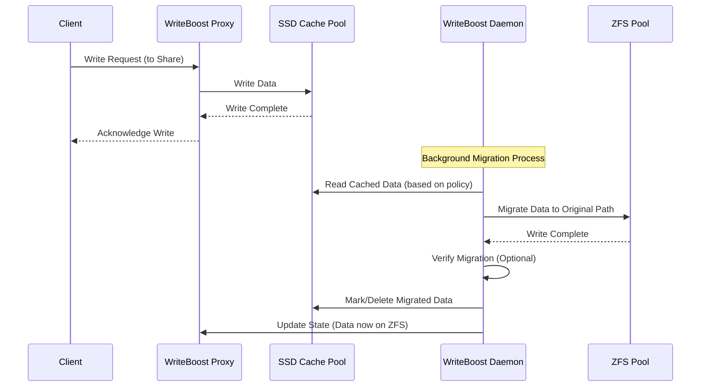
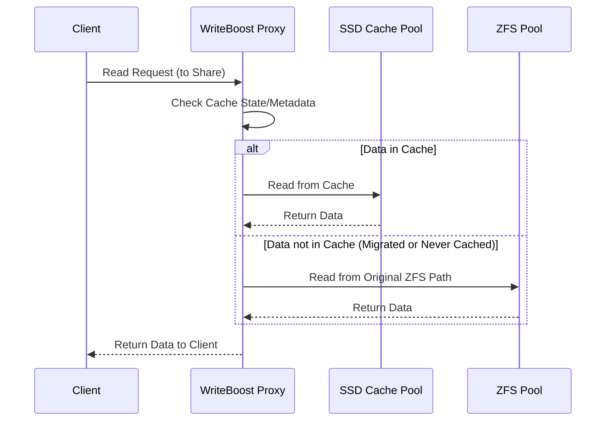

# WriteBoost: A High-Performance Proxy-Based Storage Accelerator

## Introduction

Last year, I introduced [RAID-TP (Turbo Parity)](https://jessedwyatt.com/blog/post/2024/01/raid-tp), a conceptual storage solution that proposed using Battery-Backed RAM (BBRAM) and SSDs to overcome performance limitations in traditional RAID systems. While exploring how to implement this concept practically, I encountered several fundamental challenges that led me to rethink the approach completely.

This evolution resulted in WriteBoost - a more practical and implementable solution that preserves the core value proposition of dramatically accelerated write speeds while working within the constraints of existing systems like TrueNAS.

## The Journey from RAID-TP to WriteBoost

### The Original Vision

RAID-TP emerged from a fundamental dilemma in storage design: the unavoidable trade-off between write performance and data redundancy. Traditional RAID systems, particularly parity-based configurations like RAID-5 and RAID-6, suffer from the well-known "write penalty" - the computational and I/O overhead required to calculate and store parity information. This penalty significantly reduces write speeds, creating a bottleneck in many high-performance storage scenarios.

The core insight behind RAID-TP was to leverage BBRAM as an ultra-fast intermediate storage layer. By temporarily storing parity information in BBRAM before committing it to SSDs, RAID-TP promised to eliminate the write penalty while maintaining redundancy protection. The concept was elegant in theory - a way to have the best of both worlds: speed and safety.

### The Implementation Challenge

As I delved deeper into how RAID-TP might be implemented, several sobering realities emerged:

#### The Kernel Integration Problem

My first approach was to consider how RAID-TP could be integrated into existing storage stacks. The most logical implementation would be at the block device level, similar to how traditional RAID operates. However, this presented an immediate and significant challenge:

> "Storage stack kernel development is very hard. Doing it for two different kernels (Linux and FreeBSD) significantly increases the complexity and maintenance burden."

Systems like TrueNAS, which leverage OpenZFS, have deeply integrated storage stacks with complex interactions between layers. Modifying ZFS to incorporate RAID-TP would require extensive kernel-level changes - essentially designing a new filesystem or at least a major fork of ZFS. The magnitude of this undertaking became increasingly apparent, particularly when considering:

- The need to maintain compatibility across kernel versions
- The complexity of modifying the ZFS I/O path
- The challenge of ensuring reliability with changes to critical storage code
- The need to handle error recovery, scrubbing, resilver operations, and more

#### The Networking Reality Check

While contemplating these implementation challenges, I had a crucial realization about typical NAS deployments:

> "There's absolutely no way networking could saturate the read/write capability of BBRAM on a single device."

In most real-world scenarios, network-attached storage systems are accessed via Ethernet networks (1GbE, 10GbE, or occasionally 25/40/100GbE). Even a high-end 100GbE network maxes out at approximately 12.5GB/s - far below what modern BBRAM can handle. This insight fundamentally changed the equation:

- If network speed is the bottleneck, not storage write speed
- And we're optimizing for typical NAS usage (serving data to networked clients)
- Then the ultra-fast BBRAM layer becomes unnecessary complexity

#### The SSD Array Practicality Issue

Another aspect of the original RAID-TP concept was the use of SSDs for data storage. While all-SSD arrays are becoming more common, they remain impractical for many use cases:

- Cost per terabyte is still significantly higher than HDDs
- Many NAS deployments need tens or hundreds of terabytes of storage
- Enterprise datacenters typically use tiered storage approaches for cost optimization

This realization suggested that a hybrid approach - using SSDs for acceleration while keeping the bulk of data on HDDs - would be more broadly applicable.

### The Conceptual Pivot

These insights led to a fundamental rethinking of how to achieve the original goal: dramatically improved write performance for redundant storage systems. Instead of trying to reinvent the storage stack from the block layer up, what if we focused on where the acceleration is most needed - at the network share level?

This was the key pivot that transformed RAID-TP into WriteBoost:

1. **Focus on network shares**: Target the actual interface used by clients
2. **User-space instead of kernel-space**: Operate above the filesystem layer for easier implementation and maintenance
3. **SSD caching instead of BBRAM**: Use readily available hardware that's sufficient for the network-bound workloads
4. **Plugin architecture**: Create an add-on solution rather than a replacement filesystem

## WriteBoost: Core Concept and Architecture

WriteBoost is designed as a TrueNAS plugin that dramatically improves write performance by transparently adding an SSD caching layer to existing ZFS pools. Instead of modifying the kernel or ZFS itself, it operates at the network protocol level, intercepting I/O operations targeted at specific network shares.

### Key Components

1. **WriteBoost Proxy**: A user-space service that intercepts client connections to designated shares. It handles write operations by directing them to the SSD cache, and read operations by checking if the data is in cache or needs to be fetched from the underlying ZFS pool.

2. **SSD Cache Pool**: A mirrored pair of SSDs formatted with a standard filesystem (e.g., EXT4, XFS). This serves as the initial write target, providing high-speed burst absorption capability.

3. **WriteBoost Daemon**: A background service that manages the migration of data from the SSD cache to the final ZFS pool based on configurable policies. It ensures data integrity throughout the migration process.

4. **TrueNAS Integration**: A plugin UI that makes it easy to configure accelerated shares, monitor performance, and manage the cache.

### Architectural Details

#### The Proxy Component

The heart of WriteBoost is its proxy component, which can be implemented using one of two approaches:

1. **FUSE (Filesystem in Userspace)**
   
   A FUSE-based implementation would create a virtual filesystem that the TrueNAS system would use as the source for accelerated shares:
   
   ```
   [Client] → [NAS Share] → [FUSE Filesystem] → [WriteBoost] → [SSD Cache/ZFS]
   ```
   
   With this approach:
   - TrueNAS shares are reconfigured to point to the FUSE mountpoint
   - WriteBoost intercepts all filesystem operations
   - File operations are redirected to either the SSD cache or ZFS backend
   
   The FUSE approach provides a more abstract, potentially simpler implementation but may introduce some performance overhead.

2. **Protocol-Level Proxy**
   
   Alternatively, WriteBoost could integrate directly with or intercept traffic for TrueNAS's SMB (Samba) and NFS daemons:
   
   ```
   [Client] → [SMB/NFS Protocol] → [WriteBoost Proxy] → [SSD Cache/ZFS]
   ```
   
   This approach would:
   - Modify or hook into SMB/NFS daemons to intercept operations
   - Handle protocol-specific features (locking, ACLs, etc.)
   - Potentially offer higher performance than FUSE
   
   The protocol-level approach requires deeper knowledge of SMB/NFS internals but might provide better performance.

#### Data Flow Diagrams

```
┌─────────────────────┐      ┌─────────────────────┐
│ Client (SMB/NFS)    ├──────► WriteBoost Proxy    │
└─────────────────────┘      │ (User-Space)        │
                             └─────────┬───────────┘
                                       │ ▲
                       (Cache Check)   │ │ (Read Fallback)
                                       ▼ │
┌─────────────────────┐      ┌─────────────────────┐
│   SSD Cache Pool    │◄─────┤ WriteBoost Daemon   ├─────► ZFS Pool
│ (e.g., Mirrored     │      │ (Migration & Mgmt)  │      │ (Original Target)
│  EXT4/XFS on SSDs)  │──────►                     ├◄─────┘
└─────────────────────┘      └─────────────────────┘      (Read Fallback)
```

##### Write Operation Sequence:



##### Read Operation Sequence:



These sequence diagrams illustrate the fundamental operation of WriteBoost - accelerating writes by acknowledging them immediately after writing to the SSD cache, then migrating to ZFS in the background while ensuring reads are served from the correct location.

### Crucial Trade-offs

The most significant trade-off in WriteBoost is accepting that data temporarily resides outside of ZFS protection. This is a calculated decision to enable maximum write performance. While data is in the SSD cache, it doesn't benefit from:

- ZFS checksumming
- ZFS snapshots
- ZFS compression or deduplication
- RAID-Z redundancy

This trade-off is mitigated through several mechanisms:

1. **Mandatory Mirrored SSDs**: The cache pool must use mirrored SSDs, providing redundancy for cached data.

2. **Fast Migration**: The daemon continually moves data from cache to ZFS based on configurable policies.

3. **Failure Handling**: Robust mechanisms detect drive failures and immediately prioritize data migration to ZFS.

## Real-World Implementation Details

### Installation and Configuration

To provide a practical understanding of how WriteBoost would function in a real environment, let's walk through the installation and configuration process:

1. **Plugin Installation**

   ```bash
   # From TrueNAS UI: System > Plugins > Available > WriteBoost > Install
   # Or via CLI:
   truenas plugin install writeboost
   ```

2. **Initial Setup Wizard**

   After installation, an initial setup wizard would guide the administrator through:
   
   - Selecting available SSDs for the cache pool (must select at least two for mirroring)
   - Configuring the cache pool size and filesystem (e.g., EXT4, XFS)
   - Setting migration policies and thresholds
   
   Example configuration:
   
   ```yaml
   # WriteBoost Sample Configuration
   cache_pool:
     devices:
       - /dev/sdd
       - /dev/sde
     filesystem: ext4
     size: 1000G  # Default: Use all available space
   
   migration:
     policy: hybrid
     time_threshold: 30m  # Migrate data older than 30 minutes
     fullness_threshold: 75%  # Accelerate migration at 75% cache fullness
     max_bandwidth: 500MB/s  # Maximum bandwidth for migration
     
   proxy:
     implementation: fuse  # Alternative: protocol
     mount_point: /mnt/writeboost
   ```

3. **Share Acceleration**

   Once the cache is set up, the administrator selects which shares to accelerate:
   
   ```
   # TrueNAS UI: Shares > SMB/NFS > Select Share > Edit > Acceleration: Enabled
   ```
   
   Behind the scenes, WriteBoost would:
   - Capture the original share path (e.g., `/mnt/tank/data`)
   - Create a corresponding proxy location (e.g., `/mnt/writeboost/tank/data`)
   - Modify the share configuration to use the proxy location
   - Establish the necessary mappings for the proxy to find data in both cache and ZFS

### Performance Monitoring

WriteBoost would provide a comprehensive dashboard showing:

1. **Cache Statistics**
   - Current cache utilization
   - Read hit/miss ratio
   - Write throughput
   - Migration throughput

2. **Migration Information**
   - Current migration queue size
   - Recently migrated files
   - Migration policy status

3. **Health Status**
   - SSD health metrics (via S.M.A.R.T)
   - Error counters
   - Migration journal status

### Performance Scenarios

To illustrate WriteBoost's benefits, let's examine several typical scenarios:

#### Scenario 1: 10GbE Network, Large File Transfers

**Without WriteBoost:**
- Client attempts to transfer a 500GB dataset over 10GbE (theoretical max ~1.2GB/s)
- ZFS RAID-Z2 array limited to ~400MB/s write speed
- Transfer takes ~21 minutes and is bottlenecked by ZFS write performance
- Network utilization: ~33%

**With WriteBoost:**
- Client transfers at full network speed (1.2GB/s) to SSD cache
- Transfer completes in ~7 minutes (3x faster)
- Network utilization: ~100%
- Background migration occurs at 400MB/s without affecting other operations

#### Scenario 2: Backup Server with Bursty Workloads

**Without WriteBoost:**
- Backup server sends 2TB incremental backup overnight
- Data arrives in bursts of 1-2GB/s for 5-10 minutes, then pauses
- ZFS array cannot absorb bursts efficiently, causing backup software to throttle
- Total backup window: 8 hours

**With WriteBoost:**
- SSD cache absorbs full-speed bursts without throttling
- Backup software operates at maximum speed during active periods
- Migration occurs continuously, prioritizing oldest data first
- Total backup window: 5 hours (37.5% reduction)

#### Scenario 3: Media Production Environment

**Without WriteBoost:**
- Editors saving large video files (~100GB) from editing workstations
- Save operations block the UI while waiting for ZFS to acknowledge writes
- Frequent frustration from creative team about "system freezes"

**With WriteBoost:**
- Save operations complete quickly once transferred to SSD cache
- Editors can continue working with minimal interruption
- Background migration is transparent to users
- Productivity and satisfaction increase

## Advanced Configuration and Tuning

For users looking to maximize WriteBoost performance, several advanced configuration options would be available:

### Migration Policy Fine-Tuning

The migration policy determines how and when data moves from the SSD cache to the ZFS backend. Fine-grained control would be available:

```yaml
# Advanced migration configuration
migration:
  # Default policy: hybrid, with customizable parameters
  policies:
    time_based:
      enabled: true
      threshold_minutes: 30  # Migrate files older than 30 minutes
      scan_interval: 60s  # Check for eligible files every 60 seconds
    
    pressure_based:
      enabled: true
      start_threshold: 70%  # Begin accelerated migration at 70% full
      critical_threshold: 90%  # Maximum migration priority at 90% full
      # Response curve: linear|exponential|step
      response_curve: exponential
    
    file_priority:
      enabled: true
      rules:
        - pattern: "*.tmp"
          priority: highest  # Migrate temporary files quickly
        - pattern: "*.mp4"
          priority: lowest  # Keep video files in cache longer if possible
```

### Fault-Tolerance Settings

For environments where data loss is a serious concern, WriteBoost would offer heightened fault-tolerance options:

```yaml
# Enhanced fault-tolerance configuration
fault_tolerance:
  verification:
    enabled: true  # Verify data after migration before deleting from cache
    checksum_algorithm: xxhash  # Options: none, xxhash, sha256
  
  journal:
    sync_mode: direct  # Options: direct, fsync, async
    checkpoint_interval: 100  # Checkpoint journal every 100 operations
  
  recovery:
    startup_consistency_check: full  # Options: none, quick, full
    auto_repair: true  # Attempt to repair inconsistencies automatically
```

### Protocol-Specific Optimization

For environments using specific protocols, WriteBoost could offer protocol-aware optimizations:

```yaml
# Protocol optimization settings
protocol_optimization:
  smb:
    multichannel: true  # Enable SMB multichannel support
    write_behind: true  # Enable write-behind for specific workloads
    offload_copy: true  # Support server-side copy offload
  
  nfs:
    async_writes: true  # Force asynchronous NFS writes
    tcp_optimization: true  # Optimize TCP parameters for NFS
```

## Practical Usage Examples

### Example 1: Enterprise Media Server

A media production company uses TrueNAS to store terabytes of video content accessed by numerous editing workstations. Their RAID-Z2 array of HDDs provides sufficient read performance but struggles with write operations, particularly when multiple editors save large project files simultaneously.

**Implementation:**
- Two enterprise SSDs (1.92TB each) configured in a mirrored cache pool
- WriteBoost accelerating the primary media shares
- Migration policy tuned for hybrid operation, prioritizing older files first but accelerating when cache fills beyond 70%
- Protocol optimization for SMB multichannel enabled to maximize network throughput

**Results:**
- Editors experience 5-10x faster save times for large project files
- Network utilization increases from average 30% to 80%
- Background migration occurs without impacting editing performance
- When multiple editors save simultaneously, the system remains responsive

### Example 2: Backup Target Server

A corporation uses TrueNAS as a backup target for nightly backups from dozens of servers and hundreds of endpoints. The backup window is limited to 8 hours, but the existing RAID-Z3 array cannot absorb the peak write load efficiently.

**Implementation:**
- Four data center SSDs (3.84TB each) configured as two mirrored pools
- WriteBoost accelerating the backup target shares
- Pressure-based migration policy configured to prioritize clearing space during peak backup times
- File priority rules set to expedite migration of database dumps and accelerate smaller files

**Results:**
- Backup window reduced from 8 hours to 4.5 hours
- No more backup job failures due to timeout conditions
- More consistent backup performance across all systems
- Ability to add more backup sources without extending the backup window

### Example 3: Small Business File Server

A small architectural firm uses TrueNAS for storing project files, with multiple CAD users accessing and saving files throughout the day. Their modest RAID-Z1 array exhibits sufficient read performance but sluggish write response, particularly when saving large drawing sets.

**Implementation:**
- Two consumer-grade SSDs (1TB each) configured in a mirrored cache pool
- WriteBoost accelerating the project share
- Time-based migration policy set to move files to ZFS after 1 hour
- Protocol optimization for SMB to improve performance with Windows workstations

**Results:**
- File save operations complete 3-4x faster
- Reduced user frustration during large file operations
- Background migration transparent to users
- Overall system responsiveness improved during heavy usage periods

## Technical Challenges and Solutions

Implementing WriteBoost presents several technical challenges that require careful solutions:

### Proxy Implementation

The proxy component can be implemented either through FUSE (Filesystem in Userspace) or directly at the protocol level:

- **FUSE Approach**: More abstract, potentially simpler to implement but with some performance overhead
- **Protocol-Level Approach**: Higher performance but requires deep knowledge of SMB/NFS internals

### Migration Robustness

The migration process must be extremely robust to ensure data integrity:

1. **Atomicity**: Migration operations must be atomic to prevent partial transfers
2. **Verification**: Optional verification can ensure data integrity after migration
3. **Journaling**: Persistent tracking of migration state for recovery after crashes

### Cache Management

The cache requires sophisticated management:

1. **Space Management**: Policies to prevent cache overflow
2. **Metadata Tracking**: Efficient tracking of which files are in cache vs. ZFS
3. **Priority Handling**: Identifying hot vs. cold data for migration prioritization

## DIY Minimal Implementation

For those eager to experiment with the WriteBoost concept immediately, here's a simplified DIY approach that captures the core performance benefits with minimal complexity. This stripped-down implementation sacrifices some features and robustness for ease of deployment.

### Minimal Architecture

At its core, the simplest WriteBoost-like system would consist of:

1. **Dual Share Setup**:
   - A fast write share hosted on SSDs
   - A standard read share hosted on your ZFS array
   - Both shares exposing the same folder structure

2. **Background File Migration Service**:
   - A simple daemon that monitors the write share for changes
   - Copies completed files to the ZFS read share
   - Deletes files from the SSD after successful copying

### Implementation Steps

Here's how you could set up this minimal system today:

1. **Prepare the Shares**:
   ```bash
   # Create the SSD-backed write share
   mkdir -p /mnt/ssd_write_pool/data
   # Ensure the ZFS read share exists
   mkdir -p /mnt/zfs_pool/data
   
   # Create identical folder structures on both
   # For example:
   mkdir -p /mnt/ssd_write_pool/data/projects
   mkdir -p /mnt/ssd_write_pool/data/media
   mkdir -p /mnt/zfs_pool/data/projects
   mkdir -p /mnt/zfs_pool/data/media
   
   # Share both via SMB/NFS
   # (Use your system's standard sharing mechanism)
   ```

2. **Create Migration Script**:
   ```bash
   #!/bin/bash
   # Simple file migration script from SSD to ZFS
   
   SSD_PATH="/mnt/ssd_write_pool/data"
   ZFS_PATH="/mnt/zfs_pool/data"
   LOG_FILE="/var/log/writeboost_migrate.log"
   
   log() {
     echo "$(date): $1" >> $LOG_FILE
   }
   
   # Find files on SSD older than 15 minutes
   find $SSD_PATH -type f -mmin +15 | while read file; do
     # Get relative path
     rel_path=$(echo $file | sed "s|$SSD_PATH/||")
     target="$ZFS_PATH/$rel_path"
     target_dir=$(dirname "$target")
     
     # Ensure target directory exists
     mkdir -p "$target_dir"
     
     # Copy file to ZFS
     log "Migrating: $rel_path"
     cp -p "$file" "$target"
     
     # Verify copy was successful
     if [ $? -eq 0 ] && [ -f "$target" ]; then
       # Verify file sizes match
       src_size=$(stat -c%s "$file")
       dst_size=$(stat -c%s "$target")
       if [ "$src_size" -eq "$dst_size" ]; then
         log "Success: $rel_path ($src_size bytes)"
         # Delete from SSD
         rm "$file"
       else
         log "ERROR: Size mismatch for $rel_path"
       fi
     else
       log "ERROR: Failed to copy $rel_path"
     fi
   done
   ```

3. **Set Up Periodic Execution**:
   ```bash
   # Add to crontab to run every 5 minutes
   */5 * * * * /path/to/migration_script.sh
   ```

### Usage Approach

With this minimal setup, you would:

1. **Configure Client Access**:
   - Point write operations to the SSD-backed share
   - Point read operations to the ZFS-backed share
   - (Optionally) create shortcuts/mount points to simplify access

2. **Work With The Dual Shares**:
   - Save new files to the SSD write share for maximum performance
   - Read existing files from the ZFS read share
   - Wait for the migration to occur (typically 15-20 minutes)

### Advantages of the DIY Approach

- **Immediate Implementation**: Can be set up in minutes with standard tools
- **No Special Hardware**: Works with any SSDs, no BBRAM required
- **No Kernel Modifications**: Operates entirely in user space
- **Easy to Understand**: Simple concept with minimal moving parts
- **Safe Migration**: Files are copied rather than moved, reducing data loss risk

### Limitations

This simplified approach has significant limitations compared to a full WriteBoost implementation:

- **Manual Workflow**: Users must explicitly choose the write or read share
- **Delayed Consistency**: The two shares aren't immediately consistent
- **No Transparent Failover**: Manual intervention required if an SSD fails
- **No Read Acceleration**: No automatic caching of frequently read files
- **Limited Metadata Handling**: Basic file attributes only, no advanced ACLs
- **No Policy Controls**: Fixed migration timing, no pressure-based algorithms

### Enhancement Ideas

While maintaining simplicity, a few enhancements could improve this basic setup:

1. **Inotify Monitoring**: Replace periodic scanning with inotify to detect file changes immediately
2. **Simple Proxy Script**: Create a basic proxy that redirects operations to the appropriate share
3. **Modified Migration Timing**: Adjust the file age threshold based on SSD capacity utilization
4. **Basic Logging/Monitoring**: Add a simple web dashboard to view migration status

This DIY approach offers a way to experiment with the core WriteBoost concept today, while the full-featured implementation remains in development.

## Storage Layout Details

The SSD cache pool would be organized in a specific way to maximize efficiency:

### SSD Cache Pool Organization

Implemented using a standard filesystem (EXT4, XFS) on the mirrored SSDs, the cache would include:

1. **Cached file data**
   - User data waiting to be migrated to ZFS
   - Organized to reflect original path structures

2. **Filesystem metadata**
   - Standard filesystem metadata structures
   - Permissions, timestamps, extended attributes

3. **WriteBoost Proxy state/metadata**
   - Information about which files are in cache
   - Status tracking for access patterns and aging
   - Location mappings between cache and ZFS

4. **WriteBoost Daemon migration journal**
   - Log of in-progress migrations
   - Crash recovery information
   - Verification records

## Key Considerations and Comparisons

### Comparison with Existing ZFS Technologies

Unlike existing ZFS caching technologies, WriteBoost would take a fundamentally different approach to accelerating storage:

- **L2ARC (Level 2 Adaptive Replacement Cache)** in ZFS functions primarily as a read cache. It helps accelerate read operations by storing frequently accessed data blocks on SSDs but does not address write performance limitations.

- **SLOG (Separate Intent Log)** or ZIL (ZFS Intent Log) devices only accelerate synchronous writes. These are writes where the application requires confirmation of data being safely stored before proceeding. While important for databases and certain applications, SLOG doesn't help with general write performance for the bulk of data written to a NAS.

- **WriteBoost**, by contrast, would accelerate all writes arriving via network shares by temporarily storing them on fast SSDs before migrating them to the main ZFS pool. This approach offers significant speed benefits for bulk data transfers, large file copies, and other write-intensive operations.

The key differentiator is that WriteBoost operates at a higher level in the stack (at the network share level) rather than within the ZFS layer itself. This enables it to provide acceleration without modifying the ZFS codebase, making it a potentially more practical and maintainable solution.

### Data Protection Considerations

The WriteBoost approach would introduce some calculated data protection trade-offs:

- **Data outside ZFS protection**: While data resides in the cache (before migration to ZFS), it would not benefit from ZFS features like checksumming, snapshots, compression, or RAID-Z redundancy. This is a deliberate trade-off to enable maximum write performance.

- **Mitigating mirrored SSDs**: To address the increased risk, WriteBoost would require mirrored SSDs for the cache pool. Unlike the original RAID-TP concept that used BBRAM, the WriteBoost design acknowledges that data must be adequately protected while outside the ZFS umbrella.

- **ZFS snapshot implications**: Any ZFS snapshots taken of the main pool would only include data that had already been migrated from the SSD cache at the time of the snapshot. This means very recently written data might not be captured in snapshots until migration occurred.

- **Integrity verification options**: To further mitigate risks, WriteBoost could optionally read back data from ZFS after migration to verify integrity before removing it from the cache, ensuring successful transfers despite the lack of ZFS checksums during the caching phase.

### Technical Implementation Challenges

Several technical challenges would need to be addressed for a successful implementation:

#### Cache Management

- **Cache fullness handling**: When the cache becomes full, the system would need to accelerate migration of older data to make room. If a sustained write burst overwhelmed this mechanism, the proxy might need to throttle client writes until space became available, effectively limiting clients to the migration speed.

- **Migration impact on ZFS**: The migration process (reading from cache and writing to ZFS) would add load to the ZFS pool. The system would need configurable migration rate limits to balance cache clearing with ZFS performance impact.

- **Metadata preservation**: The system would need to perfectly preserve all file metadata (permissions, timestamps, ACLs, extended attributes) during migration between the cache filesystem and ZFS.

#### Proxy Implementation Decisions

- **FUSE vs. Protocol approach**: The choice between a FUSE implementation and a protocol-level proxy would significantly impact both performance and development complexity. FUSE might be simpler to implement but could introduce overhead, while a protocol-level implementation offers better performance but requires deep knowledge of SMB/NFS internals.

- **Local application acceleration**: By default, WriteBoost would only accelerate network shares. Local applications on the TrueNAS host writing directly to ZFS paths would bypass the cache. However, administrators could create loopback NFS mounts to the accelerated shares for local application acceleration if desired.

#### Failure Recovery

- **Complete cache failure**: In the worst-case scenario where both cache SSDs fail simultaneously, unmigrated data would be lost. The system would need to gracefully handle this by entering a transparent passthrough mode, continuing to serve already-migrated data directly from ZFS while alerting administrators to the issue.

- **Partial cache failure**: If one drive in the mirrored cache fails, the system would need to enter a "Complete Cache Desaturation Mode" - migrating all data to ZFS at maximum speed, then switching to passthrough mode until the drive is replaced.

- **Power failure recovery**: Recovery after unexpected shutdowns would rely on the journaling capabilities of both the cache filesystem and the migration journal, with a comprehensive startup recovery sequence to verify consistency.

### Fault Tolerance

WriteBoost implements robust fault tolerance mechanisms to ensure data safety:

#### Cache Drive Failure

If one drive in the mirrored cache fails:
- WriteBoost enters "Complete Cache Desaturation Mode"
- All writes are redirected to the main ZFS array
- Migration is accelerated to maximum speed
- After desaturation, system enters "Passthrough Mode" until replacement
- Hot-swap detection allows recovery without reboot

#### Complete Cache Pool Failure

If both cache drives fail simultaneously:
- Any unmigrated data is lost (this is the accepted risk)
- System automatically switches to "Passthrough Mode"
- Critical alert indicates potential data loss
- Recovery requires replacing both SSDs and re-initializing

#### Power Failure / System Crash

- SSD Cache integrity relies on filesystem journaling and SSD power loss protection
- Migration journal tracks in-progress operations
- Startup recovery sequence verifies consistency and resumes operations

## Future Directions

The WriteBoost concept opens several avenues for future enhancements:

### Enhanced Integration

1. **ZFS Feature Awareness**: Develop mechanisms to better integrate with ZFS features like scheduled snapshots
2. **Improved Metadata Handling**: Enhance preservation of ZFS-specific metadata during migration
3. **Quota Awareness**: Respect ZFS dataset quotas during cache operations

### Performance Optimizations

1. **Protocol Optimization**: Tuning for specific protocols (SMB3 multichannel, NFS v4.2)
2. **Machine Learning for Migration**: Intelligent policies that learn from usage patterns
3. **Predictive Caching**: Anticipate file access patterns to optimize cache contents

### Expanded Scope

1. **Object Storage Support**: Extend WriteBoost concepts to accelerate S3-compatible storage
2. **Container Integration**: Provide acceleration for container storage interfaces
3. **Cross-System Migration**: Support migration between different storage systems, not just cache to ZFS

## Development Roadmap

Should WriteBoost move beyond the conceptual stage to actual implementation, a structured development approach would be essential. Here's how the project might progress:

### Phase 1: Core Proxy & Daemon Framework (Months 1-2)

- Develop basic proxy structure (choosing between FUSE or protocol implementation)
- Implement fundamental write-to-cache and read-fallback logic
- Establish daemon architecture with basic migration logic
- Build CLI tools for testing and debugging
- Implement foundational journaling system for data integrity

### Phase 2: Migration Robustness & Policies (Months 2-3)

- Implement robust migration journaling and recovery systems
- Develop configurable migration policies (time-based, pressure-based, hybrid)
- Add verification steps and data integrity mechanisms
- Implement error handling and state management
- Create cache fullness response strategies

### Phase 3: TrueNAS Integration (Months 3-4)

- Develop plugin package structure for TrueNAS
- Implement "share commandeering" mechanism for transparent operation
- Create UI components (SSD selection, share configuration, dashboard)
- Implement API endpoints for management
- Build configuration and status displays

### Phase 4: Testing & Optimization (Months 4-5)

- Conduct proxy performance testing with various implementations
- Perform stress testing of migration recovery under failure injection
- Test behavior during cache/ZFS pool stress conditions
- Create documentation and deployment guides
- Optimize for common workloads

### Phase 5: Beta Release & Community Feedback (Month 6)

- Limited release to testers
- Community feedback collection
- Bug fixing and refinement
- Performance benchmarking
- Documentation finalization

### Phase 6: General Release & Ongoing Development

- Public release of v1.0
- Maintenance and bug fixes
- Feature expansion based on feedback
- Performance optimization
- Expanded protocol support

## Testing Methodology

A comprehensive testing strategy would be critical for a system like WriteBoost, where data integrity and performance are both key concerns:

### Performance Testing

1. **Throughput Testing**
   - Network client-to-share testing (NFS, SMB)
   - Various file sizes and operations
   - Single client vs. multiple client access patterns
   - Sustained vs. burst performance

2. **Latency Testing**
   - Operation latency for common file operations
   - Latency distribution under various loads
   - Impact of background migration on foreground operations
   - Cache hit vs. miss latency differences
   - Protocol-specific latency factors

3. **Migration Impact**
   - Performance during active migration
   - Migration behavior under heavy write load
   - Migration throughput at various fullness thresholds
   - Cache pressure response effectiveness

### Reliability Testing

1. **Failure Injection**
   - Power loss/crash during write operations
   - Power loss/crash during migration operations
   - Cache drive removal (single, both)
   - ZFS pool unavailability during migration

2. **Recovery Testing**
   - Data consistency verification after various failures
   - Migration journal replay mechanism testing
   - Passthrough mode activation/recovery
   - Recovery time measurement for various failure scenarios

3. **Data Integrity**
   - Metadata preservation (permissions, timestamps, ACLs)
   - Optional checksumming post-migration
   - ZFS snapshot behavior testing
   - File integrity verification across the full lifecycle

### Compatibility Testing

1. **Protocol Compatibility**
   - Testing with different SMB client versions and implementations
   - Testing with different NFS client versions and implementations
   - Mixed-protocol access scenarios

2. **TrueNAS Version Compatibility**
   - Compatibility with TrueNAS SCALE (various versions)
   - Compatibility with TrueNAS CORE (various versions)
   - Upgrade path testing

3. **Hardware Compatibility**
   - Testing with various SSD models and manufacturers
   - Performance with different cache size configurations
   - Testing across various network configurations
   - Resource-constrained system testing

## Conclusion

WriteBoost represents an evolution of the RAID-TP concept into a more practical, implementable solution. By focusing on the network share level rather than the block device level, it provides significant performance benefits while working within the constraints of existing systems.

The journey from RAID-TP to WriteBoost illustrates a crucial principle in system design: theoretical ideals often need practical refinement to become viable solutions. While the original RAID-TP concept offered an elegant approach to overcoming the RAID write penalty, WriteBoost provides a more pragmatic path to achieving similar benefits without requiring fundamental changes to the storage stack.

By accepting calculated trade-offs and focusing on the real-world bottlenecks (network shares rather than kernel-level storage operations), WriteBoost delivers substantial performance improvements where they matter most for typical NAS workloads. The user-space proxy architecture provides a balance of performance enhancement and implementation feasibility that makes it a realistic addition to systems like TrueNAS.

For administrators facing the perpetual challenge of balancing write performance with redundancy, WriteBoost offers a compelling middle path - one that provides the speed benefits of direct SSD writes while maintaining the capacity and protection benefits of ZFS on traditional HDD arrays.

---

*Last updated: April 28, 2025* 